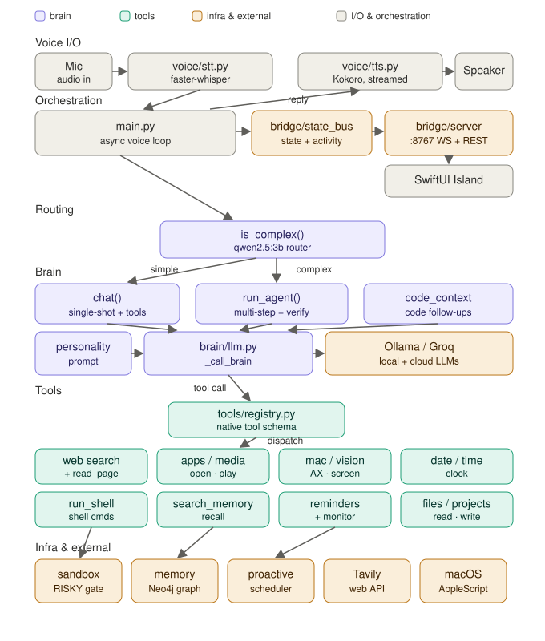

# FRIDAY

**A local-first, voice-driven AI assistant for macOS — it listens, thinks, acts, and lives in your notch.**

FRIDAY runs almost entirely on-device: local speech-to-text, a local LLM brain with native tool calling, local text-to-speech, and a personal memory graph — wrapped in a SwiftUI "notch island" that shows what she's doing in real time. Say *"what's on my calendar?"*, *"sort my downloads folder"*, or *"review the main.py in my teenyurl project"* and she does it — asking for approval before anything risky.

<!-- demo: drop a GIF or video link here — the island reconnect dance, a voice command, or the coding window in action -->



## What she can do

- **Converse by voice** — always-listening mic loop with adaptive thresholds, self-echo suppression, barge-in (interrupt her mid-sentence), and sentence-streamed TTS so she starts speaking before she's finished thinking.
- **Operate the Mac** — open/close apps, control Spotify and Netflix, navigate Chrome, run sandboxed shell commands, read and write files, take a look at your screen (local vision model) and answer questions about it.
- **Act as an agent** — multi-step tasks ("find the latest video and play it", "commit my project") run through a plan–execute–observe loop with native tool calling, retry limits, a success verifier that catches false completions ("committed" with nothing staged), and confirmation checkpoints for risky commands.
- **Handle your day** — calendar, Gmail, macOS notifications (WhatsApp/Instagram DMs), clipboard, reminders, timers, and a spoken morning briefing that weaves them together.
- **Watch things for you** — background monitors for web topics, tweets, incoming email, clipboard content, and notifications; reminders persist across restarts and fire "while you were away" if missed.
- **Remember you** — a Neo4j temporal knowledge graph: GLiNER entity extraction, typed relationships with decay rates, contradiction handling (`valid_from`/`valid_to` — new facts expire old ones instead of overwriting them).
- **Review your code** — "review teenyurl" resolves the real project on disk (even from misheard speech: *"teeny oral"* → `teenyurl`), reads the actual files, and answers from them; long reviews render in a coding window with file/code/diff cards instead of being read aloud.

## The notch island

A native SwiftUI companion app (`frontend/FridayIsland`) that docks under the MacBook notch:

- Live state with an animated face — listening, thinking, tool-running, speaking, waiting for approval. She **falls asleep when the backend is down** and wakes on reconnect (self-healing WebSocket with backoff).
- A control window with the full activity timeline — chat, tool calls, file reads, syntax-highlighted code snippets — plus typed input, one-tap approvals (⌘Y / ⌘N), and a live elapsed-time badge on every working step.
- The backend emits only **factual state** over a local bridge (`127.0.0.1:8767`); the UI derives all mood and expression. Voice, menu bar, and island all resolve the *same* pending approval.

## How it works

```
Mic ──▶ STT ──▶ Router ──▶ ┌ single-shot chat ─▶ tool ─▶ spoken answer
                (2-tier)   └ agent loop ─▶ plan → tool → observe → verify
                                │
                     sandbox (SAFE / RISKY / BLOCKED)
                                │
                    RISKY ─▶ approval (voice "yes" / menu bar / island)
                                │
        Kokoro TTS ◀── reply ◀──┘        Neo4j memory graph ◀── every turn
```

| Component | Model / Tech | Why |
|---|---|---|
| Brain | `qwen3:14b` via Ollama (thinking disabled) | 8/8 tool-selection accuracy at ~1.2 s warm; `think=True` benchmarked **2.4× slower and worse** |
| Router | `qwen2.5:3b`, temperature 0 | SIMPLE vs COMPLEX in ~220 ms; keyword pins carry the cases a 3 B model can't (measured, not assumed) |
| Vision | `qwen2.5vl:3b` | "What's on my screen?" in ~1 s warm |
| STT | faster-distil-whisper (small.en, int8) | Accurate and fast on Apple silicon |
| TTS | Kokoro-82M | Natural voice, streamed sentence-by-sentence |
| Memory | Neo4j + GLiNER | Temporal graph, not a vector dump |
| Cloud (optional) | Groq, one env flag | A/B the brain; deep code questions can route to the cloud per-turn |

Everything above runs concurrently on a 24 GB M4 Pro MacBook.

**Design principles that shaped it:**

- **Latency is a feature.** Two-tier routing (keywords answer instantly, the LLM router only sees the ambiguous middle), models pinned warm, terminal tools that skip a whole inference, spoken "thinking cues" so silence never exceeds ~1.6 s.
- **Deterministic where possible, model where necessary.** "Open it" resolves to the last result's URL by code, not by hoping the model makes the leap. Project names resolve on disk. Routing decisions are logged to JSONL, so misroutes become labeled training data.
- **Safety before power.** The shell executor classifies every command (`SAFE`/`RISKY`/`BLOCKED`), blocks shell metacharacters and sensitive paths (`.ssh`, `.env`, keychains), gates writes to protected locations (shell startup files, LaunchAgents), and requires spoken or clicked approval for anything state-changing beyond the local repo.

## Tested like it matters

The part I'm proudest of: **you don't voice-test this project, the suites do.**

```
cd backend
python test_regression.py      # 170 single-turn assertions: routing, tool selection,
                               # safety classification, parsers — every past bug is pinned
python test_conversations.py   # 19 multi-turn scenarios through the REAL pipeline
                               # (audio stubbed, tool execution faked, brain real) —
                               # catches the between-turns bugs voice testing used to find
python bench_brain.py          # latency + tool accuracy across candidate models
python bench_router.py         # raw router accuracy vs the labeled routing set
```

Every bug ever found live becomes a permanent assertion. The conversation suite caught two real bugs *on its first run*. Model choices (brain, router, thinking mode) were decided by benchmark, not vibes.

## Run it

**Requirements:** macOS (Apple silicon), Python 3.11, [Ollama](https://ollama.com), Neo4j, ~16 GB free RAM for the model set.

```sh
# models
ollama pull qwen3:14b && ollama pull qwen2.5:3b && ollama pull qwen2.5vl:3b

# services
ollama serve &
neo4j start                      # bolt://localhost:7687

# backend (voice loop + bridge + scheduler)
cd backend
python main.py                   # local brain (default)
FRIDAY_BRAIN=cloud python main.py  # optional: Groq brain (GROQ_API in backend/.env)

# notch island (separate terminal)
cd frontend/FridayIsland
swift run FridayIsland
```

Useful flags: `FRIDAY_BARGE_IN=1` (interrupt her over headphones), `FRIDAY_LOCAL_MODEL=...`, `FRIDAY_TTS_VOICE=...`, `FRIDAY_ISLAND_MOCK=1` (island UI dev without a backend).

## Project layout

```
backend/
  main.py              # voice loop, TTS pipeline, barge-in, turn orchestration
  brain/               # LLM core, routing, agent loop, personality, code context
  tools/               # 29 native tools (apps, web, files, calendar, gmail, ...)
  sandbox/             # shell command classifier + executor
  memory/              # Neo4j graph: writer, retriever, GLiNER extraction
  proactive/           # scheduler, reminders/timers/monitors, time parsing
  bridge/              # FastAPI + WebSocket state bus for the island
  test_*.py, bench_*.py
frontend/FridayIsland/ # SwiftUI notch island + control window
docs/                  # system overview, design docs
```

## Roadmap

- Mid-task course correction — *"no, the other folder"* while the agent works ([design](docs/COURSE_CORRECTION_DESIGN.md))
- Vision ReAct: screenshot → reason → act via the macOS accessibility layer
- Voice upgrades (Fish Audio) and richer island animations

## Acknowledgments

Built solo, with AI pair programmers (Claude and Codex) working in separate lanes — backend and frontend — every change gated by the regression suites before it lands.

## License

[MIT](LICENSE) © 2026 Siddharth Kumar
