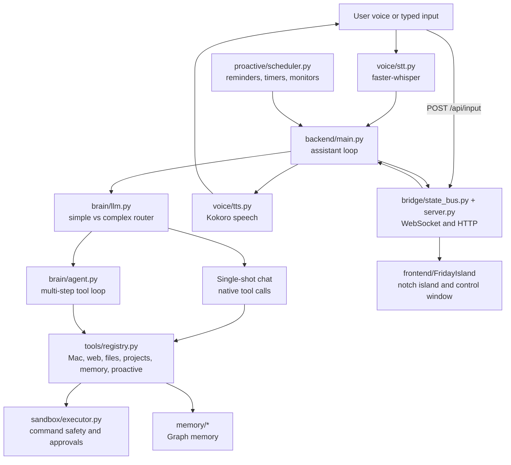

# FRIDAY System Overview

Last updated: 2026-06-30

## 1. What FRIDAY Is

FRIDAY is a local-first personal AI assistant for macOS. It is designed to feel
like a present desktop companion rather than a detached chatbot: it listens by
voice, speaks back naturally, controls local apps, reads and reviews local code,
remembers useful personal context, runs safe system actions with approvals, and
projects its state into native Mac UI surfaces.

The product idea has three layers:

1. Voice assistant: speak naturally, get short spoken answers, open apps, search
   the web, play media, manage reminders, and operate the Mac.
2. Coding copilot surface: when the task becomes code-heavy, show files,
   snippets, tool activity, and long reviews in a window instead of reading them
   aloud.
3. Ambient desktop presence: keep a small notch island near the MacBook notch
   that reflects whether FRIDAY is listening, thinking, speaking, running tools,
   or waiting for approval.

FRIDAY is intentionally not just a model wrapper. The model is one part of a
larger system that includes deterministic routing, tool schemas, a shell
sandbox, voice input/output, memory, proactive triggers, and a frontend bridge.

## 2. Design Goals

- Local-first by default: core interaction runs on the user's Mac with Ollama,
  local STT, local TTS, local files, and local app controls.
- Fast feedback: avoid long silent gaps by streaming TTS, showing terminal/UI
  state, and using short thinking cues during slow turns.
- Factual backend state: the backend emits objective states such as `thinking`,
  `tool_running`, and `approval_required`; the Swift UI maps those into charm,
  mood, expression, and animation.
- Deterministic local code understanding: for local project/code requests,
  FRIDAY must read real files from disk before reviewing or explaining them.
- Safety before power: shell actions are classified, sensitive paths and shell
  metacharacters are blocked, and risky operations require approval.
- Spoken gist, visual detail: voice should stay natural and brief; code, long
  reviews, markdown, and tool timelines belong in the window.
- Additive UI bridge: the Python backend should run correctly whether or not
  the Swift frontend is connected.

## 3. High-Level Architecture



The backend process is the center of the system. It owns the voice loop,
queues, model routing, tool execution, memory, proactive scheduler, and bridge
server. The frontend is a native Swift app that subscribes to state and activity
events from the backend.

## 4. Runtime Entry Point

The main runtime is `backend/main.py`.

At startup, it:

- configures the bridge approval/input hooks;
- starts the local state bridge on `127.0.0.1:8767`;
- starts TTS generator and player worker threads;
- optionally starts the menu bar app;
- initializes the proactive scheduler;
- warms the brain, router, and memory paths;
- enters the assistant loop.

The assistant loop then alternates between:

1. waiting until FRIDAY is not speaking;
2. taking typed input from the Swift UI if queued, otherwise listening on the
   microphone;
3. transcribing speech;
4. publishing the user message to the UI activity stream;
5. routing the turn through deterministic confirmation/code/follow-up checks or
   through the model router;
6. running simple chat or the multi-step agent;
7. delivering a final reply to the UI and TTS pipeline.

## 5. Voice Input: STT

Voice input lives in `backend/voice/stt.py`.

Current stack:

- `faster_whisper.WhisperModel`
- default model: `systran/faster-distil-whisper-small.en`
- sample rate: 16 kHz
- fixed threshold by default: `FRIDAY_STT_THRESHOLD=0.012`
- adaptive threshold exists but is off by default because it made the assistant
  less reliable in noisy or echo-heavy conditions
- pre-roll buffer captures audio before speech crosses the threshold, reducing
  clipped first words
- Whisper VAD is enabled by default with configurable silence parameters

Important environment variables:

- `FRIDAY_STT_MODEL`
- `FRIDAY_STT_THRESHOLD`
- `FRIDAY_STT_ADAPTIVE`
- `FRIDAY_STT_MAX_SILENCE`
- `FRIDAY_STT_PRE_ROLL_SECONDS`
- `FRIDAY_WHISPER_VAD`
- `FRIDAY_AUDIO_DEBUG`
- `FRIDAY_MIC_DEVICE`

The STT loop is deliberately conservative. It prefers a known-good fixed
threshold and uses a watchdog so FRIDAY does not stay permanently stuck at
"Listening" if no speech starts.

## 6. Voice Output: TTS

Voice output lives in `backend/voice/tts.py`.

Current stack:

- Kokoro `KPipeline`
- default voice: `af_bella`
- sample rate: 24 kHz before output conversion
- persistent `sounddevice.OutputStream`
- output sample-rate detection and optional resampling
- clipping protection, light soft saturation, and fade-in/fade-out
- markdown/code cleanup before speech

Important environment variables:

- `FRIDAY_TTS_VOICE`
- `FRIDAY_TTS_SPEED`
- `FRIDAY_TTS_PEAK`
- `FRIDAY_TTS_FADE_MS`
- `FRIDAY_TTS_OUTPUT_RATE`
- `FRIDAY_AUDIO_DEBUG`

The TTS pipeline is split into two workers:

- `tts_generator_worker`: converts queued text chunks into audio chunks.
- `tts_player_worker`: plays audio, updates state to `speaking`, then returns
  to `idle` when the queues empty.

This allows long responses to begin speaking before every sentence has finished
synthesizing.

## 7. Barge-In and Speech Coordination

`backend/main.py` has optional barge-in support:

- `FRIDAY_BARGE_IN=1` enables interruption while FRIDAY is speaking.
- `FRIDAY_BARGE_THRESHOLD` controls sensitivity.
- the effective threshold scales with system output volume to reduce
  self-interruption from speaker bleed.

Because laptop speakers can leak FRIDAY's own voice back into the mic, barge-in
is off by default. The current safer setup is push-to-speak style turn-taking:
FRIDAY speaks, then listens again.

FRIDAY also stores the last spoken text and uses a self-echo check to discard
transcriptions that are mostly her own audio being picked up by the microphone.

## 8. Brain and Routing

The brain layer lives mostly in `backend/brain/llm.py`.

Current model setup:

- local default model: `qwen3:14b`
- local router model: `qwen2.5:3b`
- Ollama keep-alive: `30m`
- `think=False` is used for Qwen-style thinking models to avoid long hidden
  reasoning delays before tool calls
- optional cloud backend: Groq-compatible OpenAI client when `FRIDAY_BRAIN=cloud`

Important environment variables:

- `FRIDAY_LOCAL_MODEL`
- `FRIDAY_BRAIN`
- `FRIDAY_CLOUD_MODEL`
- `GROQ_API` or `GROQ_API_KEY`
- `FRIDAY_FORCE_LOCAL`

The router decides whether a turn is simple or complex:

- Simple turns can use single-shot chat with native tool calling.
- Complex turns use the multi-step agent.
- Deterministic signals are checked before the small router model when possible.

The single-shot path supports native tool calls, streaming text, and a "last
result" cache so follow-ups such as "open it" can resolve to URLs found in the
previous search result.

## 9. Multi-Step Agent

The multi-step agent lives in `backend/brain/agent.py`.

It is used when a request needs planning, tool iteration, file inspection,
multi-step web research, code work, shell work, or verification.

Core behavior:

- max iterations: 10
- native tool-call messages instead of JSON-in-text parsing
- one tool step at a time
- explicit prompt rules for project resolution, file reading, browser/media
  routing, and shell command style
- no `look_at_screen` for file, git, web, app, or media tasks
- no `search_web` for understanding the user's local code
- final replies must be grounded in actual tool results

The agent also has an important guardrail: if the model says something like
"Let me read the file" but does not actually call a tool, that is treated as an
unfinished step and the agent is pushed to act.

### Verification

For consequential tools such as `run_shell` and `write_file`, the agent can ask
a cheap local verifier whether the goal was actually achieved. This is controlled
by:

- `FRIDAY_VERIFY=1` by default

Verification is fail-open: verifier ambiguity must not strand the user.

## 10. Tools

The tool registry is `backend/tools/registry.py`.

It exposes a static `TOOLS` dictionary and builds native tool schemas for the
brain. Tool descriptions are part of the control surface: they tell the model
when to use each tool, what arguments to pass, and what not to do.

Current tool categories:

- Apps: `open_app`, `close_app`, `get_running_apps`
- Browser/media: `navigate_browser`, `play_media`
- Web: `search_web`, `read_page`
- Files/projects: `read_file`, `write_file`, `find_project`,
  `read_project_file`
- Shell: `run_shell`
- Date/time: `get_date_time`
- Memory: `search_memory`
- Screen/vision: `take_screenshot`, `look_at_screen`
- Reminders/timers/monitors: `set_reminder`, `set_timer`, `list_reminders`,
  `cancel_reminder`, `set_monitor`
- Calendar/email: `get_calendar`, `read_email`, `watch_email`

The tool layer is intentionally mixed:

- some tools are pure Python;
- some use macOS APIs or AppleScript;
- some call browser/web services;
- shell commands go through the sandbox executor;
- memory tools talk to the graph memory layer.

## 11. Shell Sandbox and Approval System

Shell safety lives in `backend/sandbox/executor.py`.

The executor classifies commands as:

- `SAFE`
- `RISKY`
- `DANGEROUS`
- `INVALID`

It blocks:

- shell metacharacters such as `&&`, `|`, `;`, redirects, backticks, and command
  substitution;
- sensitive paths such as `.ssh`, `.env`, keychains, shell histories, and
  credential stores;
- destructive commands such as `rm`, `sudo`, `dd`, `chmod`, `chown`, `kill`,
  `curl`, `wget`, and interactive shells;
- dangerous patterns such as `rm -rf`.

Safe local git actions include status/log/diff/show/branch/fetch/stash/tag and
local add/commit. Remote or history-rewriting git actions such as push, pull,
merge, rebase, reset, checkout, switch, and restore are treated as risky.

Risky commands return:

```text
NEEDS_CONFIRMATION: <command>
```

The main loop then enters `approval_required`, emits approval activity to the
UI, and waits for approval from voice, menu bar, or the Swift app.

## 12. Local Project and Code Understanding

Local project resolution currently has two related pieces:

1. `backend/tools/projects.py`
2. `backend/local_code.py`

`tools/projects.py` is the active deterministic tool path used by the agent.
It resolves spoken or typed project names against real folders under
`~/Projects` using:

- normalized exact match;
- substring match;
- fuzzy match.

It also provides `read_project_file(project, filename)`, which resolves the
project and reads a likely source file in one step. It handles spoken filename
normalization such as:

- `main dot p y` -> `main.py`
- `main dot py` -> `main.py`

The agent prompt explicitly says:

- always call `find_project` first when the user names a project;
- prefer `read_project_file` for project file questions;
- answer from contents actually read;
- never use web search for the user's local code.

`backend/local_code.py` is an older deterministic pre-agent local-code
interceptor. It contains a richer resolver/reviewer pipeline but is currently
opt-in through:

```text
FRIDAY_LOCAL_CODE=1
```

It is disabled by default because it over-triggered on unrelated folder/listing
requests. The current preferred path is: let the agent use deterministic project
tools instead of trying to intercept every local-code intent before routing.

## 13. Code Context and Follow-Ups

`backend/brain/code_context.py` maintains a small working set of recently read
files.

When tools such as `read_file` or `read_project_file` succeed, `main.py` calls:

```python
code_context.record_tool(name, args, result)
```

That lets follow-up questions like "is it secure?", "how does the endpoint
work?", or "what would you improve?" answer from the already read code instead
of restarting the full agent loop.

The working set:

- stores up to 4 recent files;
- caps context to around 16k characters;
- detects code-related follow-up questions;
- routes deeper questions to cloud when available unless forced local.

This is one of the main systems that makes the coding window feel closer to
Codex or Claude: the conversation can continue around concrete files instead of
collapsing back into generic summaries.

## 14. Memory System

The memory layer lives in `backend/memory/*`.

Its purpose is to store durable personal context: people, relationships,
preferences, projects, plans, and facts that should matter in future turns.

Current pieces:

- `store.py`: async memory pipeline entry point
- `retrieve.py`: graph search for relevant memory
- `writer.py`: graph write interface
- `extractor.py`: entity extraction
- `reasoner.py`: converts utterances and current graph state into memory deltas
- `schemas.py`: structured memory schema definitions
- `profile.py` and `tools.py`: supporting memory utilities

The store path is intentionally gated:

- short greetings and control phrases are skipped;
- obvious commands such as open/play/search are skipped;
- self-facts and corrections are allowed through;
- the expensive write pipeline runs in a background executor.

Retrieval returns either a `<system_memory>` block of triples/events or the
explicit sentinel:

```text
No relevant memories found.
```

This sentinel matters because an empty string made the model more likely to
fabricate personal facts.

Operational note: the memory backend depends on local graph infrastructure
(for example Neo4j via the writer). If it is offline, FRIDAY logs the memory
retrieval error and continues running.

## 15. Proactive Layer

The proactive layer lives in `backend/proactive/*` and is exposed through tools
in `backend/tools/reminders.py`, `backend/tools/monitor.py`, and
`backend/tools/email_watch.py`.

The scheduler is `backend/proactive/scheduler.py`.

It provides:

- reminders;
- timers;
- recurring triggers;
- monitors;
- persistence to `~/FRIDAY/reminders.json`;
- startup replay for overdue reminders/timers;
- a registry for future trigger kinds.

The scheduler calls a `speak` callback injected by `main.py`, so proactive
alerts use the same TTS and state bus path as normal assistant replies.

Monitors are modeled as trigger kinds. They wake on an interval, run their own
check logic, and only speak when there is something worth alerting the user
about.

## 16. Backend Bridge

The bridge is the contract between Python and Swift.

Files:

- `backend/bridge/state_bus.py`
- `backend/bridge/server.py`
- `backend/bridge/activity.py`
- `backend/bridge/README.md`
- `backend/bridge/CODING_WINDOW_CONTRACT.md`

It runs inside the Python backend process on:

```text
127.0.0.1:8767
```

Endpoints:

```text
WS   /ws/state
GET  /api/health
POST /api/approval
POST /api/input
```

The bridge is additive. If the Swift app is not connected, the backend still
runs normally.

### State Snapshot

Every state message contains factual top-level fields:

```json
{
  "state": "speaking",
  "outcome": "neutral",
  "message": "Speaking...",
  "transcript": "open spotify...",
  "replyPreview": "On it, Sir.",
  "tool": null,
  "requiresApproval": false,
  "pendingCommand": null,
  "brain": "local",
  "activity": []
}
```

States:

- `idle`
- `listening`
- `transcribing`
- `thinking`
- `tool_running`
- `speaking`
- `approval_required`
- `error`

The backend does not send `mood`. Mood and expression are UI-side concepts.

### Activity Timeline

The coding window uses a structured `activity` stream. On initial WebSocket
connect, the first snapshot includes up to 80 historical events. Later messages
include only new events, and the Swift app deduplicates by event id.

Activity kinds:

- `user_message`
- `assistant_message`
- `status`
- `tool_call`
- `file_read`
- `file_write`
- `code_snippet`
- `diff`
- `approval`
- `error`

This is the backbone of the Codex/Claude-style window: tool activity, file
cards, code snippets, approvals, and final answers are rendered as first-class
timeline objects.

### Spoken vs Displayed Replies

`bridge/activity.py` owns the split between voice and screen.

For short conversational replies:

- publish the full reply to the UI;
- speak the full reply.

For rich replies such as code reviews, long markdown, lists, or fenced code:

- publish the full reply to the UI;
- speak only a short gist ending with a pointer to the screen.

This prevents FRIDAY from reading code blocks, markdown, or long review
documents aloud.

## 17. Frontend: Native macOS App

The frontend is a Swift Package in:

```text
frontend/FridayIsland
```

It targets macOS 14 and uses SwiftUI plus AppKit.

Run command:

```sh
cd frontend/FridayIsland
swift run FridayIsland
```

### Main Pieces

- `main.swift`: app entry point
- `AppDelegate.swift`: app lifecycle, store wiring, menu/window ownership
- `AssistantModels.swift`: shared state/activity models and UI expression mapping
- `AssistantStore.swift`: WebSocket connection loop, activity store, mock fallback,
  approval and typed input actions
- `BackendClient.swift`: HTTP and WebSocket client for the bridge
- `IslandPanelController.swift`: always-on-top transparent notch panel
- `FridayIslandView.swift`: compact/expanded notch island surface
- `FaceView.swift`: animated face/expression renderer for the notch
- `BitmapAnimationView.swift`: optional bitmap animation playback
- `FridayControlWindowController.swift`: resizable coding window controller
- `FridayControlWindowView.swift`: large FRIDAY coding/chat window

### Notch Island

The notch island is the ambient identity surface. It is intended to sit near the
MacBook notch and reflect current state with a face, glow, expression, and
compact status.

Expression is derived locally:

- `idle` -> sleepy
- `listening` -> attentive
- `transcribing` -> focused
- `thinking` -> curious
- `tool_running` -> determined
- `speaking` -> warm
- `approval_required` -> expectant
- `error` -> concerned

The backend sends facts; the island decides how those facts feel.

### Control Window

The control window is the work surface. It is where FRIDAY becomes closer to
Codex, Claude, Gemini, or ChatGPT for code tasks.

It shows:

- header state, status pill, live/offline indicator, brain badge;
- activity filters;
- user and assistant chat bubbles;
- compact tool rows;
- file cards;
- syntax-highlighted code cards;
- approval cards;
- quick action chips;
- typed input composer.

It consumes the same WebSocket state as the notch island but renders richer
activity objects.

## 18. Terminal UX and Logging

Logging lives in `backend/logger.py`.

There are two output channels:

1. persistent logs under `~/FRIDAY/logs`;
2. concise terminal status lines.

By default, the terminal is intentionally quiet. It should show human-level
progress such as:

```text
FRIDAY: Starting up
FRIDAY: Models ready
Listening
Transcribing
You: ...
Thinking: routing request
Agent: Running read_project_file
FRIDAY: ...
```

Full log firehose is enabled with:

```sh
FRIDAY_DEBUG=1 python main.py
```

Audio-specific debug output is enabled with:

```sh
FRIDAY_AUDIO_DEBUG=1 python main.py
```

Both can be combined:

```sh
FRIDAY_DEBUG=1 FRIDAY_AUDIO_DEBUG=1 python main.py
```

Status lines can be disabled with:

```text
FRIDAY_STATUS=0
```

## 19. Backend and Frontend Run Commands

Backend:

```sh
cd /Users/siddharthkumar/Projects/FRIDAY/backend
python main.py
```

Backend with debug logs:

```sh
cd /Users/siddharthkumar/Projects/FRIDAY/backend
FRIDAY_DEBUG=1 FRIDAY_AUDIO_DEBUG=1 python main.py
```

Frontend:

```sh
cd /Users/siddharthkumar/Projects/FRIDAY/frontend/FridayIsland
swift run FridayIsland
```

The Swift app connects to the live backend if `127.0.0.1:8767` is available. If
not, it falls back to a mock timeline so the UI can still be developed.

## 20. Configuration Surface

Important environment variables by area:

### Brain

- `FRIDAY_LOCAL_MODEL`
- `FRIDAY_BRAIN`
- `FRIDAY_CLOUD_MODEL`
- `FRIDAY_FORCE_LOCAL`
- `FRIDAY_VERIFY`

### Speech

- `FRIDAY_STT_MODEL`
- `FRIDAY_STT_THRESHOLD`
- `FRIDAY_STT_ADAPTIVE`
- `FRIDAY_STT_MAX_SILENCE`
- `FRIDAY_STT_PRE_ROLL_SECONDS`
- `FRIDAY_WHISPER_VAD`
- `FRIDAY_TTS_VOICE`
- `FRIDAY_TTS_SPEED`
- `FRIDAY_TTS_PEAK`
- `FRIDAY_TTS_FADE_MS`
- `FRIDAY_TTS_OUTPUT_RATE`
- `FRIDAY_AUDIO_DEBUG`

### Interaction

- `FRIDAY_BARGE_IN`
- `FRIDAY_BARGE_THRESHOLD`
- `FRIDAY_THINKING_CUES`
- `FRIDAY_THINKING_CUE_FIRST_SEC`
- `FRIDAY_THINKING_CUE_SECOND_SEC`
- `FRIDAY_MENUBAR`
- `FRIDAY_STATUS`
- `FRIDAY_DEBUG`

### Code

- `FRIDAY_LOCAL_CODE`
- `FRIDAY_LOCAL_CODE_ROUTER`

### Cloud/API Keys

The code supports cloud brain keys through environment variables such as
`GROQ_API` or `GROQ_API_KEY`. Secret values should live outside documentation
and should not be committed.

## 21. Testing and Quality Gates

Existing test and bench files include:

- `backend/test_regression.py`
- `backend/test_capabilities.py`
- `backend/test_terminal.py`
- `backend/test_proactive.py`
- `backend/test_memory_pipeline.py`
- `backend/test_mac_core.py`
- `backend/test_spotify.py`
- `backend/test_netflix.py`
- `backend/bench_brain.py`

Useful test themes:

- router classification stays stable;
- tool schemas remain valid;
- shell sandbox blocks dangerous commands;
- project resolution handles spoken/fuzzy names;
- reading code containing words like `HTTPException` is not treated as a tool
  failure;
- bridge emits correct state and activity events;
- approval flow works through voice, menu bar, and Swift UI;
- typed input reaches the same routing path as voice;
- TTS does not crackle or underflow under normal model load.

## 22. Current Limitations

- The local-code interceptor exists but is disabled by default because it can
  over-trigger; the active path relies on agent prompt rules plus deterministic
  project tools.
- The control window has a strong backend contract, but UI polish and animation
  are still evolving.
- Speech is local and free, but Kokoro voices can still sound less natural than
  premium cloud voices.
- True audio-reactive mouth animation is not implemented yet; the state model
  reserves `amplitude` for future use.
- Memory depends on local graph infrastructure. If the graph is down, FRIDAY
  continues but memory retrieval/storage degrades.
- Web and X/Twitter scraping are inherently fragile because modern sites often
  require logged-in sessions, dynamic rendering, anti-bot checks, or official
  APIs.
- MCP is not currently the core tool system. The current tool registry is
  native Python. MCP can be added later as a namespaced external tool layer.

## 23. Suggested Roadmap

### Near Term

- Improve coding window polish: better code highlighting, tabs/file cards,
  smoother activity state transitions, and clearer "current work" indicator.
- Fix stale thinking/speaking animation state in the UI by making state
  transitions follow final assistant activity more tightly.
- Add diff cards for file writes and patch-style edits.
- Add file tree or open-file sidebar for local project review.
- Add explicit cancel/stop controls for long-running turns.

### Medium Term

- Implement richer local code review:
  - deterministic multi-file selection;
  - project summaries;
  - dependency graph;
  - test discovery;
  - security checklist;
  - "apply suggestion" flow with approvals.
- Add true audio amplitude events from TTS into the bridge for mouth animation.
- Add better voice options while preserving local/offline fallback.
- Add stronger source attribution for web/news answers.
- Add a durable conversation transcript store that the window can reopen.

### Longer Term

- Add an MCP layer for long-tail external integrations.
- Add a permission model for external tools:
  - read-only vs write tools;
  - destructive confirmation;
  - per-server allowlists;
  - UI-visible audit log.
- Add background skill packs for calendar, email, browser, dev tooling, and
  project management.
- Build a more complete Claude/Codex-style coding environment:
  - files;
  - diffs;
  - commands;
  - tests;
  - approvals;
  - commit/PR summaries.

## 24. Mental Model for Future Contributors

Think of FRIDAY as four cooperating systems:

1. Conversation runtime: listens, transcribes, routes, thinks, speaks.
2. Tool runtime: resolves projects, reads files, searches web, controls apps,
   executes safe shell commands, and asks approval when needed.
3. State bridge: converts backend events into a stable factual stream for native
   UI surfaces.
4. Experience layer: makes the assistant feel alive through voice, terminal
   progress, notch animation, and the coding window.

When adding a feature, choose the right layer:

- factual capability goes in backend tools;
- planning/routing rules go in brain prompts or deterministic routers;
- user-visible status goes through `state_bus` and activity events;
- charm, expression, animation, and layout go in Swift;
- risky actions go through the sandbox and approval flow;
- secrets stay out of code and docs.

That separation is what keeps FRIDAY powerful without turning it into a fragile
pile of model guesses.

